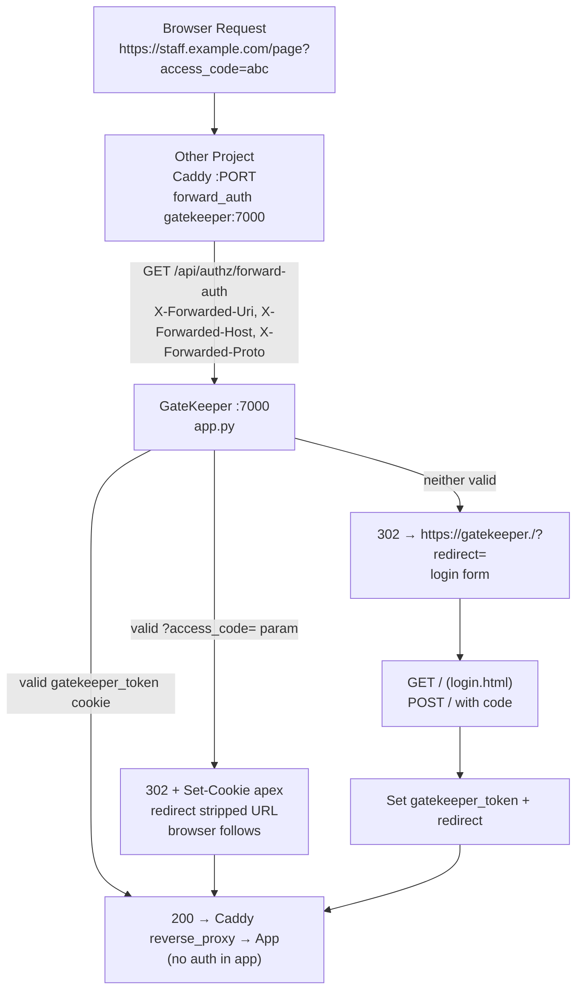

# Architecture

## Stack at a Glance

| Layer | Choice |
|-------|--------|
| Runtime | Python 3.14-slim, Gunicorn `gthread` (prod) — Flask dev server only locally |
| Framework | Flask single-file monolith `app.py` |
| Cookie signing | `itsdangerous.URLSafeSerializer(secret_key, salt="cookie")` |
| DB | `sqlite3` stdlib, WAL mode, file `gatekeeper.db` (`DB_DIR` env, default app dir, `/data` in container) |
| WSGI | Gunicorn `1 worker / 4 threads` |
| Docs | MkDocs Material (`mkdocs==1.6.1`) on `:8005`, FastAPI + granian, `USER appuser` |
| Proxy | No Caddy in this repo — GateKeeper *is* the gate. Other projects' Caddy `forward_auth` calls it on `gatekeeper_default` |

---

## Monolith Topology — Intentionally Single-File

This is a **monolith by design** (`reference/flask/structure.md`) — one purpose (auth gate), 2 pages + one API, single SQLite table. Splitting into blueprints would add files without reducing complexity.

```text
project/
├── app.py                      # app = Flask(__name__), all routes + helpers
├── templates/
│   ├── base.html               # minimal base
│   ├── login.html              # access code form
│   └── manage.html             # code table + create/invalidate
├── static/css/manage.css       # dark portfolio theme for /manage
├── requirements.txt            # flask>=3.0, itsdangerous>=2.0, gunicorn>=23.0
├── requirements-dev.txt        # pytest>=8,<10
├── Dockerfile                  # python:3.14-slim, compileall, USER appuser 10001, gunicorn :7000
├── compose.yaml                # gatekeeper + documentation services
├── entrypoint.sh               # chown /data at startup (volume retains root ownership)
├── documentation/              # MkDocs site (this site)
│   ├── mkdocs.yml
│   ├── requirements.txt        # mkdocs 1.6.1 + material 9.7.6 etc
│   ├── Dockerfile              # python:3.14-slim, mkdocs build, granian :8005
│   ├── app.py                  # FastAPI serving site/ + /health
│   └── docs/                   # index, getting-started, architecture, auth-flow, ...
├── tests/
│   ├── conftest.py             # SECRET_KEY/MANAGE_PASSWORD/DB_DIR tmp_path fixture
│   └── test_smoke.py           # forward_auth + manage auth
└── .env.example                # docs-only, no .env loaded ever
```

### DB Initialization — No Import Side Effects

```python
# app.py — canonical shape
_db_initialized = False

@app.before_request
def ensure_db():
    global _db_initialized
    if _db_initialized:
        return
    db = get_db()
    db.execute("""CREATE TABLE IF NOT EXISTS codes (...)""")
    try:
        db.execute("ALTER TABLE codes ADD COLUMN last_accessed TIMESTAMP")
    except sqlite3.OperationalError:
        pass
    backup = os.environ.get("BACKUP_CODE")
    if backup:
        # seed if missing
        ...
    db.commit()
    _db_initialized = True
```text

- Factory-free monolith still avoids import-time DB hits — work happens on the first request.
- `get_db()` uses `g` + `PRAGMA journal_mode=WAL`; `close_db` on `teardown_appcontext`.
- `init_db()` exists for CLI/tools and reuses `ensure_db()` under `test_request_context`.

---

## Request & Auth Flow



### Caddy Calls GateKeeper Over Docker DNS

```text
Cloudflare Tunnel → Caddy (joins gatekeeper_default) → GateKeeper :7000
                         ├─ forward_auth check (200/302)
                         └─ then reverse_proxy → app container (never sees unauthenticated traffic)
```

- GateKeeper publishes `127.0.0.1:7000:7000` for local/tunnel; other projects reach it as `gatekeeper:7000` on `gatekeeper_default`.
- Caddy sends `X-Forwarded-Uri` (original path+query), `X-Forwarded-Host`, `X-Forwarded-Proto`; GateKeeper reconstructs redirect targets from all three.

---

## Networks & Caddy Decision

```text
networks:
  default: {}
  gatekeeper:
    external: true
    name: gatekeeper_default
  cloudflared-tunnel:
    external: true
    name: cloudflared-tunnel_default
```

**Why no Caddy in this repo:** GateKeeper is the gate itself. Gating GateKeeper with `forward_auth gatekeeper:7000` would be a self-loop. House `reference/gatekeeper/*` still applies — other projects' Caddy instances join `gatekeeper_default` and call `gatekeeper:7000`. Docs are therefore **not gated** and intentionally not exposed via Caddy here.

**Documentation exposure:** The `documentation` service is **internal-only** — `expose: ["8005"]`, healthcheck via `python -c urllib`, `networks: [default]`, no `ports:`. Reach it as `http://gatekeeper_documentation:8005` from sibling containers. For a future Caddy, the correct public route would be:

```caddy
handle_path /documentation/* {
    reverse_proxy gatekeeper_documentation:8005
}
# no forward_auth — docs are public, GateKeeper is the gate
```text

No `/documentation/*` gate, no auth on docs.

---

## Data Model

Single table `codes` in `gatekeeper.db`:

```sql
CREATE TABLE codes (
    id INTEGER PRIMARY KEY,
    code TEXT UNIQUE NOT NULL,
    label TEXT,
    active INTEGER DEFAULT 1,
    created_at TIMESTAMP DEFAULT CURRENT_TIMESTAMP,
    last_accessed TIMESTAMP
);
```

- `code` is 16-hex (`secrets.token_hex(8)`), plaintext in SQLite.
- `BACKUP_CODE` env seeds a row `label="backup"` when missing.
- `active=0` (invalidate) is instant global kill — next `forward_auth` fails.
- `last_accessed` is updated on every successful auth (`SELECT ... AND active=1` → `UPDATE ... SET last_accessed = CURRENT_TIMESTAMP`); migration self-heals via `ALTER TABLE ... ADD COLUMN` in try/except.

---

## Ports

| Port | Service | Notes |
|------|---------|-------|
| 7000 | GateKeeper (gunicorn) | loopback-bound, external tunnel may expose login; docs of other projects call `gatekeeper:7000` internally |
| 8005 | Documentation (granian) | internal-only, `expose`, not published |

GateKeeper owns the **7000 block** (house rule: ports allotted in groups of 10).

## Deployment Notes

- **No caddy container** — this is the exception. If a caddy is added later, it must proxy to `gatekeeper_main:7000` (unique `container_name`, never generic `app`) and must NOT gate `/documentation/*`.
- Entrypoint fixes named-volume ownership (`chown -R appuser:appuser /data`) because pre-non-root volumes retain `root` ownership.
- Build caching: `COPY requirements.txt` + `pip install` before `COPY . .`; `compileall -q /app` catches syntax errors at build time.

## History

- Initial version: app-level middleware `gatekeeper_check()` + `/api/verify` tickets (5-min TTL). Every app embedded auth.
- Rewrite `b4d54d7`: **forward_auth only**, all app-level code removed. Apps are now naked behind the gate — do not reintroduce `/api/verify` or `GATEKEEPER_INTERNAL`.
