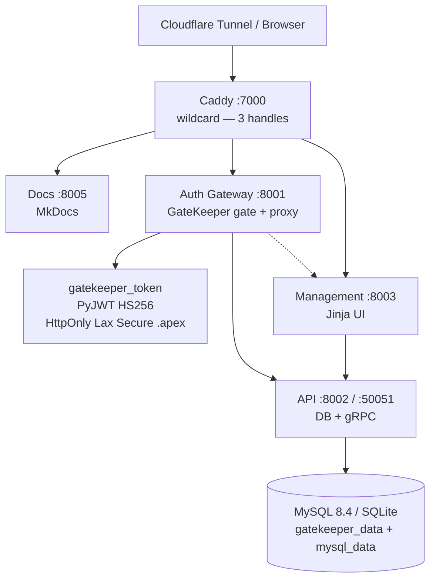

# GateKeeper

FastAPI gateway that protects every web app on one apex domain behind a signed access-code cookie. Caddy `GateKeeper gate` is the only gate — apps hold zero auth code and zero GateKeeper secrets.

**Stack:** Python 3.14 · FastAPI + Granian · SQLAlchemy 2 (async) · MySQL 8.4 / SQLite · Caddy 2 · PyJWT · Docker Compose

## Services

| Service | Container | Port | Purpose | Network |
|---------|-----------|------|---------|---------|
| **Caddy** | `gatekeeper_caddy` | `:7000` (127.0.0.1) | Wildcard ingress + GateKeeper gate | `default`, `gatekeeper`, `gatekeeper`, `net-data` |
| **Auth Gateway** | `gatekeeper_auth` | `:8001` | GateKeeper gate + wildcard proxy | `default`, `net-api`, `gatekeeper` |
| **API** | `gatekeeper_api` | `:8002` + `:50051` (gRPC) | DB owner, CRUD, gRPC LogAuth | `net-api`, `net-data` |
| **Management** | `gatekeeper_management` | `:8003` | Admin UI (Jinja + CSRF) | `net-api` |
| **MySQL** | `gatekeeper_db` | `:3306` | Primary store | `net-data` |
| **Documentation** | `gatekeeper_documentation` | `:8005` | MkDocs (FastAPI + granian) | `default` |

Shared layer `shared/` holds `config.py` (pydantic-settings), `jwt.py` (`PyJWT HS256` `iss=gatekeeper` `aud=projectnova.download`, visitor `exp` = `session_lifetime_hours`, `manage_session` `8h`), `models.py` (6 tables + `settings` + `audit_logs` with `method/status_code/attempted_code`), `settings_spec.py` (the settings keys, their accepted values and their fallback direction, read by the API validator, both reader services and the manage form), `security.py` (pbkdf2, host/path match), `gate.py` (rule dispatch + the unmatched-request decision, shared by both gate paths), `rule_defaults.py` (catch-all backfill), `backup.py` (signed config export), `error_pages.py`; `shared/db.py` (async engine) is imported only by `api:8002` (`net-data` sole writer `gatekeeper_data` + `mysql_data`).



```
Request → Caddy → Auth Gateway /api/authz/forward-auth
 ├─ maintenance_mode on → 503 (manage hosts exempt)
 ├─ valid gatekeeper_token → 200 → proxy to Route upstream
 ├─ valid ?access_code= → 302 + Set-Cookie (apex)
 ├─ valid custom_password → 200 (per rule)
 ├─ no rule matched in a matching group → 302 (always, see Rules)
 └─ no group matched the host → `unmatched_action` (default 302)
```

## Quick Links

| Link | Description |
|------|-------------|
| [Getting Started](getting-started.md) | Env vars, run locally + in Docker |
| [Architecture](architecture.md) | 7-service layout, DB, networks |
| [Auth Flow](auth-flow.md) | GateKeeper gate, magic links, rule dispatch, maintenance mode |
| [Cookie Contract](cookie-contract.md) | gatekeeper_token + siblings |
| [Management UI](manage-panel.md) | /manage/login, dashboard, stat strip, settings, CSRF |
| [Caddy Integration](caddy-integration.md) | Wildcard + per-app gating |
| [Docker](docker.md) | Images, compose, healthchecks |
| [Routes](routes.md) | DB-driven host→upstream |
| [Rules](rules.md) | Groups, actions, shadowing |
| [Logs & Audit](logs.md) | Audit, visitor country, the viewer map, top pages, settings, dry-run |

## House Reference

Follows `agent_stuff/reference/`: `fastapi/` (routers, Granian), `docker/` (slim, loopback, external nets), `gatekeeper/` (single cookie, GateKeeper gate, apex deduction), `conventions/docs-readme.md` (tracked `documentation/` MkDocs Material 1.6.1 on 8005).
