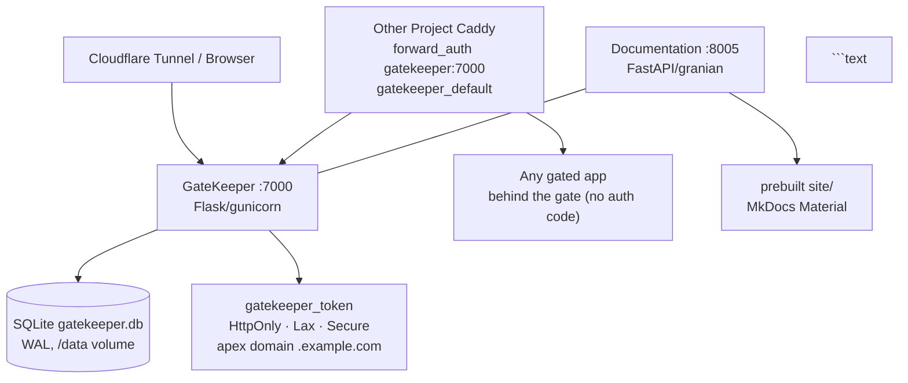

# GateKeeper

Lightweight **Flask** auth service that protects every web app on one apex domain behind a single signed access-code cookie. Caddy `forward_auth` is the only gate — apps behind it hold zero auth code and zero GateKeeper secrets.

**Stack:** Python 3.14 · Flask 3.x + Gunicorn (gthread) · `itsdangerous` URLSafeSerializer · SQLite (WAL) · Docker Compose

## Services Overview

| Service | Container | Internal Port | Purpose | Network |
|---------|-----------|---------------|---------|---------|
| **GateKeeper** | `gatekeeper_main` | `:7000` | Auth gate + login + manage + forward_auth | `default`, `gatekeeper`, `cloudflared-tunnel` |
| **Documentation** | `gatekeeper_documentation` | `:8005` | MkDocs site (FastAPI + granian) | `default` |

- Port **7000** is the only published port (`127.0.0.1:7000:7000`, reachable via Cloudflare Tunnel/Caddy of other projects).
- `GET /health` is public for probes; everything else is either login or the `forward_auth` check.
- Documentation is **internal-only** (no Caddy in this repo). It is reachable as `http://gatekeeper_documentation:8005` inside the compose network and via `docker compose` port-forward for local preview. See [Docker](docker.md) and [Architecture](architecture.md) for why there is no Caddy here.


Request → Caddy forward_auth → GateKeeper /api/authz/forward-auth
                                ├─ valid gatekeeper_token cookie   → 200 → Caddy proxies to app
                                ├─ valid ?access_code= on URL     → 302 + Set-Cookie (apex, no expiry)
                                │                                     + redirect, param stripped
                                └─ neither                         → 302 → https://gatekeeper.<apex>/?redirect=<original>
```text

## Quick Links

| Link | Description |
|------|-------------|
| [Getting Started](getting-started.md) | Prerequisites, env vars, run locally + in Docker |
| [Architecture](architecture.md) | Layout, request flow, DB, networks, file tree |
| [Auth Flow](auth-flow.md) | Full forward_auth sequence, magic links, open-redirect guard |
| [Cookie Contract](cookie-contract.md) | gatekeeper_token signing, domain, attributes |
| [Manage Panel](manage-panel.md) | /manage Basic-auth, create/invalidate, last_accessed |
| [Caddy Integration](caddy-integration.md) | How any new project gates behind GateKeeper |
| [Docker](docker.md) | Dockerfile (python:3.14-slim, appuser), compose, healthchecks |
| [Why No gRPC](why-no-grpc.md) | Why this single-service gate has no gRPC |

## Relationship to House Reference

This project follows `~/Projects/agent_stuff/reference/`:

- **Monolith shape** (`reference/flask/structure.md`) — single `app.py` is intentional; no blueprints needed for 2 pages + one API.
- **Docker** (`reference/docker/dockerfile.md`, `reference/docker/compose.md`) — `python:3.14-slim`, `PYTHONDONTWRITEBYTECODE=1`, `pip --no-cache-dir`, `compileall`, `appuser` uid `10001`, loopback-only publish, external `gatekeeper_default` + `cloudflared-tunnel` networks, `urllib` healthcheck.
- **GateKeeper** (`reference/gatekeeper/*`) — single cookie, only `GET /api/authz/forward-auth`, apex-domain deduction, no hardcoded domains.
- **Documentation** (`reference/conventions/docs-readme.md`) — tracked `documentation/` MkDocs Material (`mkdocs==1.6.1`), FastAPI on `8005`, `USER appuser`, granian.
- **No gRPC** (`reference/fastapi/grpc.md`) — single service, no container-to-container calls, so no `api:50051`.

No `.github/workflows` — strict local `pre-commit` only per `reference/conventions/precommit.md`.
